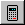

.. index:: 
   pair: Plan; Displaying
   pair: Plan; Calculating

Calculating/Displaying a plan
-----------------------------

Once you have entered the data in all the fields you are now ready to
calculate a plan. You can cause the Results window to be displayed either by
clicking on the 'Calculate' button |Calc|
on the speed bar, or by clicking on the 'Calculate' option on the menu bar.
This window is a scrollable page with the various parameters you have entered
and the results of the treatment plan.

