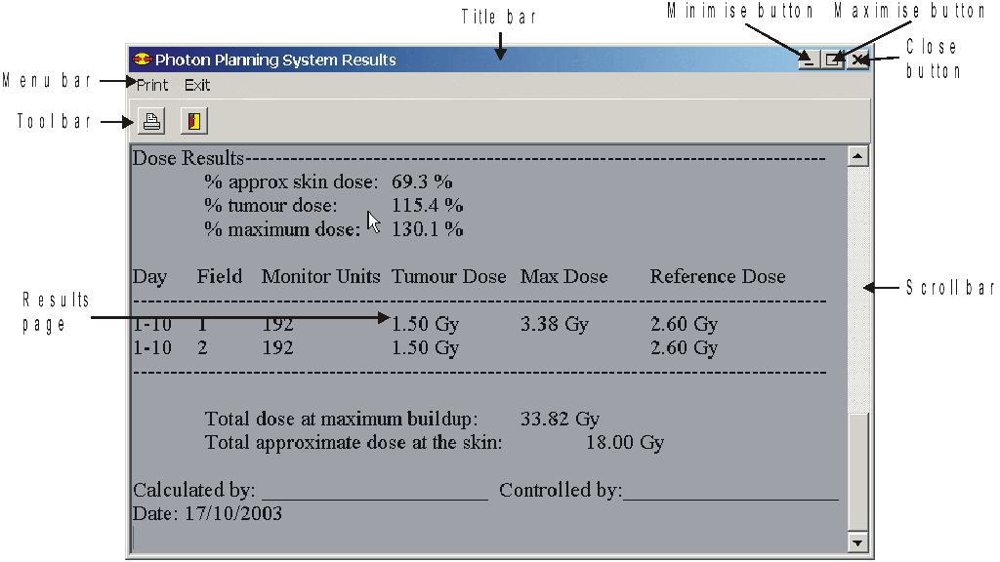

.. index:: Results; Viewing

Viewing the results page
------------------------

Take a while to have a look at the Results window page as shown in Figure 6

**Figure 6: Components of the Results window.**

The Results window has its own Title bar, Menu bar and Speed button bar with
different options from the Data Entry window. The results are displayed
underneath the Speed button bar. You may view the different part of the
Results page by using the Scroll bar situated to the right hand side of the
Results page. Move to top of the page by dragging the block in the scroll bar
up. Move to the bottom of the page dragging the block in the scroll bar down.
Alternatively you may use the <Page Up> and <Page Down> keys on the keyboard.
The <up> and <down> arrow keys will also perform the same function, but will
move through the text one line at a time. Practice viewing the different
parts of the Results page. The results will be printed exactly as they are
displayed here, so make sure that your parameters are correct before you
print.

