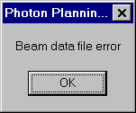
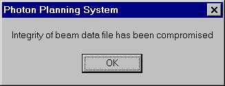

.. index:: Errors; File

Beam data file errors
---------------------

The first set of errors that can occur concern the Beam Data file. The
program keeps its data in files with a '*.bdf' extension. If these files have
become corrupted or have been deleted or are missing for any reason, the
program will not run but will instead generate an error. The following errors
are possible.

Beam Data File error:
~~~~~~~~~~~~~~~~~~~~~

This means that the program cannot find the Beam Data file. Either the file
has been deleted, or it cannot be opened, or for some reason it is missing.
The Beam Data file will need to be regenerated. Please contact the medical
physicist who installed the program to regenerate the Beam Data file.

**Figure 10: Beam data file error.**

Integrity of Beam Data File has been compromised:
~~~~~~~~~~~~~~~~~~~~~~~~~~~~~~~~~~~~~~~~~~~~~~~~~

This means that the Beam Data file has become corrupted in some fashion. The
Opposing Fields Program checks the data file before using it to ensure that
the file is okay. Again the Beam Data file will have to be reloaded and
regenerated. Contact the medical physicist who installed this program to do
this.

**Figure 11: Data file integrity error.**