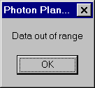
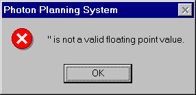

.. index:: Errors; Data

Data errors
-----------

The second set of errors concern the data entered. As stated before, a number
of validation checks are carried out on the data. If you receive a data
error, first of all check your most recently entered value. When you press
the 'Calculate' button or select the 'Calculate' option, another check is
performed on the data as well. In addition to the warning messages you may
receive one of the following errors.

Data Out of Range:
~~~~~~~~~~~~~~~~~~

You have tried to calculate a plan with data that is invalid. Go back and
scan through your data making sure your values are correct. Be careful of
spaces, characters and punctuation marks in numeric fields.

**Figure 12: Data range error.**

Econvert:
~~~~~~~~~

One or more of your values cannot be converted to a number. Go back and scan
through your data making sure your values are correct. Be careful of spaces,
characters and punctuation marks in numeric fields.

EinvalidNumber:
~~~~~~~~~~~~~~~

One or more of your fields contains invalid characters. Go back and scan
through your data making sure your values are correct. Be careful of spaces,
characters and punctuation marks in numeric fields.

Not a valid floating point number:
~~~~~~~~~~~~~~~~~~~~~~~~~~~~~~~~~~

One or more of your fields contains invalid characters. Go back and scan
through your data making sure your values are correct. Be careful of spaces,
characters and punctuation marks in numeric fields.

**Figure 13: Invalid floating point number error.**

Other errors may be generated by the Windows sub-system. Please note the
error, where it occurred and contact technical assistance.

If going through your plan data does not solve your problem, then try exiting
the program and starting it again as a final measure.

