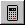

.. index:: Tutorial

Getting Started (A Tutorial)
============================

Run the Opposing Fields program as described in  If you are successful, the Opposing Fields program
will appear on the screen with all the fields greyed out as shown in Figure 1.

.. image:: _static/OPFHelp7_html_143b3990.png

**Figure 1: The Opposing fields program.**

Take some time to look at the window containing the Opposing Fields program.
You will see that there are a number of different sections. We will not go
into these sections in detail now, but will discuss them later on. For the
time being, select 'File' on the menu bar and click on 'New' to create a new
patient. The grey fields will now become white as illustrated by Figure 2

.. image:: _static/OPFHelp7_html_167be4c1.png

**Figure 2: A new patient.**

Various fields must now be filled in with the details of the treatment plan.
Some fields require values and others do not but for the purposes of this
tutorial we will fill them all in. Select the 'Patient name' field by
clicking on the white box next to the label, 'Patient name:'. The cursor
should now appear in the box and you should be able to type in it. Type the
name ``Joe Soap``. Now press the <Tab> key to move you into the next field, which
will be the 'Date' field. Type today's date in this field. You may type the
date in any format you like. When you have typed in the date, press the <Tab>
key once more to bring you to the next field, which will be the 'Diagnosis'
field. For the diagnosis, type ``CA Prostate``. Press <Tab> to bring you to the
birth date field and type ``2/4/72``. Press <Tab> and then type in the comment,
``This is a test``.

You have now completed the 'Patient Particulars' section. Press <Tab> again
to bring you into the 'Prescription' section. You will see that the next
field, the 'Dose type' field becomes highlighted in blue. This is the type of
dose that you want to prescribe. You can either choose 'Tumour dose', or
'Maximum dose'. To choose click on the little down arrow |Down|
next to the field and a list will be displayed allowing you to select which
dose type you require. Click on this arrow and practice moving between tumour
dose and maximum dose. For the purposes of this demonstration we will remain
with tumour dose. Press <Tab> again to take you to the next field. This is
the total dose that must be prescribed. Enter in ``30`` for this field and press
<Tab> again. Enter in ``10`` for the number of fractions, and press <Tab> to
bring you into the 'Treatment Parameters' section.

Here again we have a selection field. We are going to do an Opposing Fields
treatment, so it is not necessary to click on the down arrow to select it; it
is already there. So we can just press <Tab> to move onto the next field
which is the 'Treatment Technique' field. We are going to do an isocentric
treatment, so again we don't need to select an alternate option, so press
<Tab> to bring you onto the 'Machine' field. Normally your accelerator will be
the default machine so press <Tab> to go to the 'Energy' field. In the
'Energy' field we want to select the 6 MV photons so click on the down arrow
with the mouse and select 6 MV. This now sets the energy selection to the
low-energy photons. Press <Tab> to bring you to the 'Presentation' field. As
our treatment is going to be anterior and posterior we don't need to make any
selection. Press <Tab> again to move to 'Field Size'. You must now define the
Y field size or length. We will make it a 15 x 20 field. Type ``15`` in the Y
field and press tab to move to the X or breadth and then type in ``20``. Press
<Tab> again to bring you to the 'Patient Diameter' field. Type in ``25`` for the
patient diameter.

You will notice that the next two fields are grey. This means that you cannot
enter data into them. They only become available when certain options have
been selected. Press <Tab> again and the cursor will jump the 'Treatment
Depth' field and the 'SSD' field and you will go to the 'Normalisation' field.
Note however, that the values in the Treatment Depth and SSD have been
updated. This is because the program calculates them automatically to
eliminate the possibility of mistakes. We will not be using any tray, table
or compensator factors, so these will all remain '1'. Simply press <Tab>
until you reach the 'Compensator Factor' field. Your screen should look like
Figure 3. We are now ready to calculate the
treatment plan.

.. image:: _static/OPFHelp7_html_41b5c590.png

**Figure 3: The completed tutorial.**

Click on the little 'Calculator' button |Calc|
on the tool bar at the top of the program screen. A new window will appear
containing the results of the data that has just been typed in looking like
Figure 4. The monitor units that must be given to
the patient are displayed in the middle of the 'Results' window. The monitor
units are presented in the middle of the screen. You can scroll through the
data by pressing the <Page Up> and <Page Down> keys to have a look at what
you have typed and to make sure that everything is correct.

**Figure 4: The Results Window.**

Our next step is to print the plan that we have created. Click on the printer
icon |Print|
in the menu bar in the new window. Make sure that your printer is ready and
has paper. The print dialogue box will appear. If you are ready to print,
press 'OK'; otherwise press 'Cancel'. If you have done everything correctly,
your plan should now be appearing out of the printer. For further information
see Printing a plan. The plan can now be placed in the patient's file and
verified. Close the 'Results' window by clicking on the little door icon |Exit|
next to the printer icon on the tool bar. This will return you back to the
Treatment Parameters window.

.. |Print| image:: _static/OPFHelp7_html_m6490242c.png

.. |Exit| image:: _static/OPFHelp7_html_m1de0880e.png

Now we must save our treatment plan. Click on the floppy disk icon |Save|
on the tool bar and the Save dialogue box will appear. Type in the file name
for the patient. This can be as long as you like but should not contain any
extensions, as the program will add its own special extension to your
filename. When you have done this click the 'Save' button on the dialogue box
to save the patient under your new file name. Now our data is saved in case
anything should go wrong. For further information see Saving a plan.

.. |Save| image:: _static/OPFHelp7_html_6444748f.png

Congratulations, you have successfully calculated your first plan. Take some
time now to play with the program. Try out the various different options and
try displaying and printing various different treatment plans. Don't worry
about doing anything wrong; the program has various safeguards built in that
will not allow you to make mistakes. Likewise, it is very difficult for you
to lose data.

